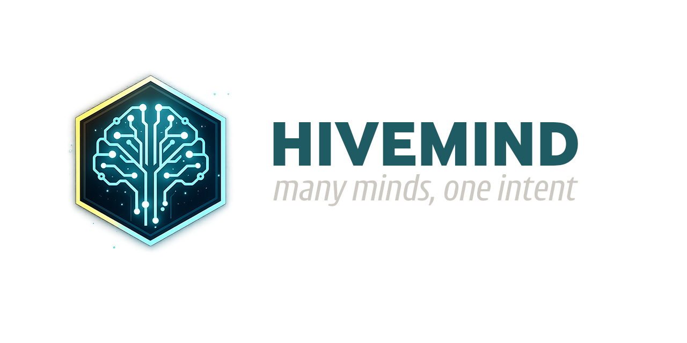

<p align="center">
  
</p>

# Hivemind MCP Server

[](https://www.npmjs.com/package/@hiveforge/hivemind-mcp)
[](https://github.com/hiveforge-io/hivemind/actions/workflows/test.yml)
[](https://github.com/hiveforge-io/hivemind/actions/workflows/release.yml)
[](https://codecov.io/gh/hiveforge-io/hivemind)
[](https://opensource.org/licenses/MIT)
[](https://github.com/hiveforge-io/hivemind/issues)
[](https://github.com/hiveforge-io/hivemind/stargazers)

An MCP (Model Context Protocol) server for Obsidian worldbuilding vaults that provides AI tools with consistent, canonical context from your fictional worlds.

## What is Hivemind?

Hivemind bridges your Obsidian vault (where you maintain your worldbuilding canon) and AI tools (Claude, ComfyUI, etc.) via the Model Context Protocol. It ensures AI-generated content stays consistent with your established characters, locations, lore, and approved assets.

## Features

- 🔍 **HybridRAG Search**: Combines vector, graph, and keyword search for accurate context retrieval
- 📚 **Obsidian Native**: Works with standard markdown, YAML frontmatter, and wikilinks
- 🎨 **Asset Provenance**: Track AI-generated images and their generation settings
- 🔐 **Local-First**: Your data stays on your machine, with optional cloud deployment
- ✅ **Canon Management**: Draft → Pending → Canon approval workflow
- 🚀 **High Performance**: <300ms query latency, supports 1000+ note vaults

## Quick Start

### Installation

```bash
# Install globally
npm install -g @hiveforge/hivemind-mcp

# Or use with npx (no installation needed)
npx @hiveforge/hivemind-mcp init
```

### Setup

```bash
# Interactive setup - creates config.json
npx @hiveforge/hivemind-mcp init

# Validate your configuration
npx @hiveforge/hivemind-mcp validate

# Start the server
npx @hiveforge/hivemind-mcp start

# Or start with a specific vault path (no config needed)
npx @hiveforge/hivemind-mcp --vault /path/to/vault
npx @hiveforge/hivemind-mcp --vault .  # Use current directory
```

### Configuration for MCP Clients

**Claude Desktop** (`%APPDATA%\Claude\claude_desktop_config.json`):
```json
{
  "mcpServers": {
    "hivemind": {
      "command": "npx",
      "args": ["-y", "@hiveforge/hivemind-mcp", "start"]
    }
  }
}
```

**Claude Desktop with vault override**:
```json
{
  "mcpServers": {
    "hivemind": {
      "command": "npx",
      "args": ["-y", "@hiveforge/hivemind-mcp", "--vault", "C:\\Path\\To\\Your\\Vault"]
    }
  }
}
```

**GitHub Copilot** (`~/.copilot/mcp-config.json`):
```json
{
  "mcpServers": {
    "hivemind": {
      "type": "local",
      "command": "npx",
      "args": ["-y", "@hiveforge/hivemind-mcp", "start"],
      "tools": ["*"]
    }
  }
}
```

### Manual Configuration

If you prefer to configure manually, create a `config.json`:

```json
{
  "vault": {
    "path": "/path/to/your/obsidian/vault",
    "watchForChanges": true,
    "debounceMs": 100
  },
  "server": {
    "transport": "stdio"
  },
  "indexing": {
    "strategy": "incremental",
    "batchSize": 100,
    "enableVectorSearch": false,
    "enableFullTextSearch": true
  }
}
```

## Architecture

```
Obsidian Vault → File Watcher → Markdown Parser → Knowledge Graph
                                                         ↓
                                     ┌───────────────────┴─────────────────┐
                                     │                                     │
                              Full-Text Index                      Vector Index
                                 (SQLite)                            (FAISS)
                                     │                                     │
                                     └───────────────────┬─────────────────┘
                                                         ↓
                                                  HybridRAG Router
                                                         ↓
                                                    MCP Server
                                                         ↓
                                              AI Clients (Claude, etc.)
```

## Development Status

**Current Phase**: Phase 1 - MVP Complete ✅

### Roadmap

See [.planning/PROJECT.md](.planning/PROJECT.md) for the active requirements and progress tracking.

**Recently Completed:**
- [x] Project setup and dependencies
- [x] Vault reading and file watching (VaultReader, VaultWatcher)
- [x] Markdown parsing with wikilinks (MarkdownParser)
- [x] Knowledge graph construction (GraphBuilder, HivemindDatabase)
- [x] HybridRAG search implementation (SearchEngine)
- [x] MCP tools (query_character, query_location, search_vault, rebuild_index)
- [x] CLI vault override flag (--vault)
- [x] Automatic stale index detection on startup
- [x] ComfyUI integration with workflow management
- [x] Obsidian plugin with image generation and frontmatter tools
- [x] GitHub release automation for plugin distribution
- [x] Test coverage improvement (37% → 45%)
- [x] CodeQL security scanning integration

**Up Next:**
- [ ] Obsidian plugin community submission (automated release ready)
- [ ] Testing and validation
- [ ] Vault templates standardization
- [ ] Canon workflow implementation

## Documentation

- [Project Requirements & Roadmap](.planning/PROJECT.md)
- [Architecture Research](.planning/research/ARCHITECTURE.md)
- [Technology Stack](.planning/research/STACK.md)
- [Features Specification](.planning/research/FEATURES.md)

## License

MIT

## Contributing

We welcome contributions! Please see [CONTRIBUTING.md](CONTRIBUTING.md) for guidelines.

**Important**: This project uses [Conventional Commits](https://www.conventionalcommits.org/). Commit messages must follow the format:

```
<type>: <description>

[optional body]

[optional footer]
```

Common types: `feat`, `fix`, `docs`, `style`, `refactor`, `test`, `chore`

Example: `feat: add pagination support to search results`
