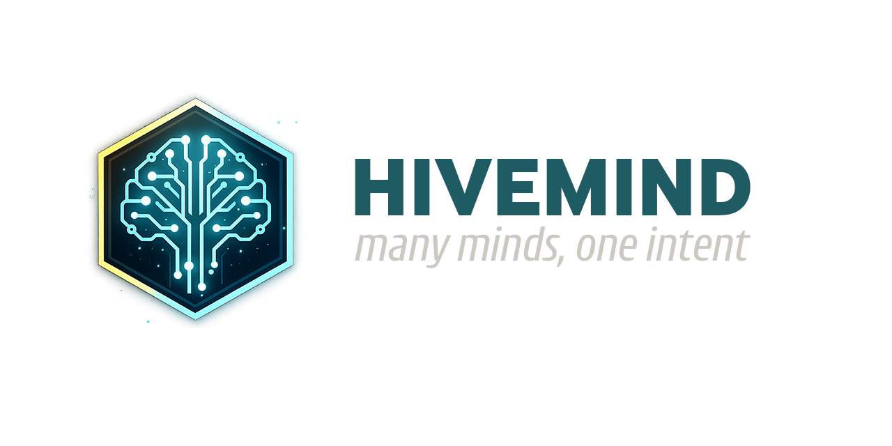

<p align="center">
  
</p>

# Hivemind for Obsidian

[](https://opensource.org/licenses/MIT)

**Your canon is the source of truth. AI stays inside the lines.**

## Why Hivemind?

When building fictional worlds — whether you're writing a novel, designing a game, or running an RPG campaign — AI tools can be powerful collaborators. But they hallucinate. Ask your AI assistant about a character you created last week, and it might invent details that contradict your established canon.

Hivemind solves this by giving AI tools structured access to your Obsidian vault. Think of it as an **AI Firewall**: your worldbuilding notes become a truth anchor that keeps AI grounded in facts you control. Ask about a character, and the AI reads your actual notes — not a hallucinated version. Query a timeline, and it references your established events — not invented dates.

Beyond AI integration, Hivemind provides powerful visualization tools:
- **Timeline View** — See your story's events laid out chronologically
- **Graph View** — Explore relationships between characters, locations, factions, and more
- **Canon Workflow** — Track which content is approved, in review, or still draft

Hivemind is built for worldbuilders, but the same principles apply to research vaults, people management, software architecture — anywhere you need AI to respect your established knowledge.

## Features

- **Timeline View** — Visualize events chronologically with filtering and search
- **Graph View** — Explore entity relationships with interactive visualization
- **AI Integration** — MCP-compatible server for Claude, GitHub Copilot, and other AI tools
- **Pluggable Templates** — Built-in templates for worldbuilding, research, people management, and more
- **Canon Workflow** — Draft → Pending → Canon approval system with consistency validation
- **Obsidian Native** — Works with standard markdown, YAML frontmatter, and wikilinks
- **Local-First** — Your data stays on your machine

### Built-in Templates

| Template | Use Case | Entity Types |
|----------|----------|--------------|
| **Worldbuilding** | Fiction writers, game designers, RPG creators | Characters, Locations, Events, Factions, Lore, Assets |
| **Research** | Academics, knowledge workers | Papers, Citations, Concepts, Notes |
| **People Management** | Managers, team leads | People, Goals, Teams, 1:1 Meetings |
| **Software Architecture** | Engineers, architects | Systems, Components, ADRs, Constraints |

Define your own custom entity types via config — no code required. See [CONTRIBUTING_TEMPLATES.md](CONTRIBUTING_TEMPLATES.md) for details.

## Installation

### Obsidian Plugin (Recommended)

1. Open Obsidian Settings
2. Go to Community plugins → Browse
3. Search for "Hivemind"
4. Click Install, then Enable

### Manual Installation

1. Download the latest release from [GitHub Releases](https://github.com/hiveforge-sh/hivemind/releases)
2. Extract to your vault's `.obsidian/plugins/hivemind` directory
3. Reload Obsidian and enable the plugin in Settings

### AI Integration (Optional)

Want AI tools to query your vault? Set up the MCP server:

**[MCP Setup Guide →](docs/MCP_SETUP_GUIDE.md)**

The guide covers:
- Claude Desktop configuration (Windows, macOS, Linux)
- GitHub Copilot configuration
- Template selection
- Troubleshooting

## Quick Start

1. **Choose a template** — Open Hivemind settings in Obsidian and select a template (worldbuilding, research, etc.)

2. **Create entities** — Use Obsidian's note creation as usual. Add YAML frontmatter to define entity types:
   ```yaml
   ---
   entity_type: character
   canon_status: draft
   ---
   ```

3. **Visualize** — Open the Timeline view or Graph view from the ribbon icons

4. **Connect to AI** — Follow the [MCP Setup Guide](docs/MCP_SETUP_GUIDE.md) to let AI tools query your vault

For detailed setup instructions, see [docs/SETUP_GUIDE.md](docs/SETUP_GUIDE.md).

## Screenshots

### Timeline View
*Coming soon — chronological visualization of events*


### Graph View
*Coming soon — interactive entity relationship visualization*


## Use Cases

**Worldbuilding:**
- Track characters, locations, and events across your novel
- AI remembers your character details when helping with dialogue
- Visualize timeline of your story's key events

**Research:**
- Organize papers, citations, and concepts in your field
- AI references your actual research when answering questions
- Explore connections between concepts in your knowledge base

**People Management:**
- Track team goals, 1:1 meeting notes, and people details
- AI recalls context from previous meetings when drafting agendas
- Visualize team relationships and reporting structures

**Software Architecture:**
- Document systems, components, and architectural decisions (ADRs)
- AI references your ADRs when suggesting design patterns
- Track dependencies between components visually

## Documentation

- [Setup Guide](docs/SETUP_GUIDE.md) — Getting started with Hivemind
- [MCP Setup Guide](docs/MCP_SETUP_GUIDE.md) — AI integration configuration
- [Vault Migration Guide](docs/VAULT_MIGRATION_GUIDE.md) — Migrating existing vaults
- [Canon Workflow](docs/CANON_WORKFLOW_ENTERPRISE.md) — Using canon workflow beyond worldbuilding
- [Contributing Templates](CONTRIBUTING_TEMPLATES.md) — Create and share templates
- [Sample Vaults](samples/README.md) — Example vaults for each template

## Community

- **Issues & Feature Requests** — [GitHub Issues](https://github.com/hiveforge-sh/hivemind/issues)
- **Discussions** — [GitHub Discussions](https://github.com/hiveforge-sh/hivemind/discussions)

## Contributing

We welcome contributions! Please see [CONTRIBUTING.md](CONTRIBUTING.md) for guidelines.

**Important**: This project uses [Conventional Commits](https://www.conventionalcommits.org/). Commit messages must follow the format:

```
<type>: <description>

[optional body]
```

Common types: `feat`, `fix`, `docs`, `style`, `refactor`, `test`, `chore`

## License

[MIT](LICENSE) — Free for personal and commercial use.
